# Deepfake Detection System — Complete Architecture Documentation

> Comprehensive technical architecture of the Deepfake Detection System, derived directly from the codebase. Every diagram maps to actual classes, functions, and data flows in the implementation.

---

## Table of Contents

1. [System Architecture](#1-system-architecture)
2. [Detailed Component Architecture](#2-detailed-component-architecture)
3. [Data Flow Architecture](#3-data-flow-architecture)
4. [Use Case Diagram](#4-use-case-diagram)
5. [Sequence Diagrams](#5-sequence-diagrams)
6. [Class Diagrams](#6-class-diagrams)
7. [Activity Diagrams](#7-activity-diagrams)
8. [System Component Interaction](#8-system-component-interaction)
9. [Deployment Architecture — Local Development](#9-deployment-architecture--local-development)
10. [Deployment Architecture — Production](#10-deployment-architecture--production)
11. [Security Architecture](#11-security-architecture)
12. [State Machine Diagram — Threat Score Zones](#12-state-machine-diagram--threat-score-zones)
13. [Entity Relationship Diagram](#13-entity-relationship-diagram)
14. [Architecture Summary](#14-architecture-summary)

---

## 1. System Architecture

> High-level overview showing every layer from raw media input through EfficientNet-B0 inference to final output. Maps directly to `web-app.py`, `classify.py`, and `inference/video_inference.py`.

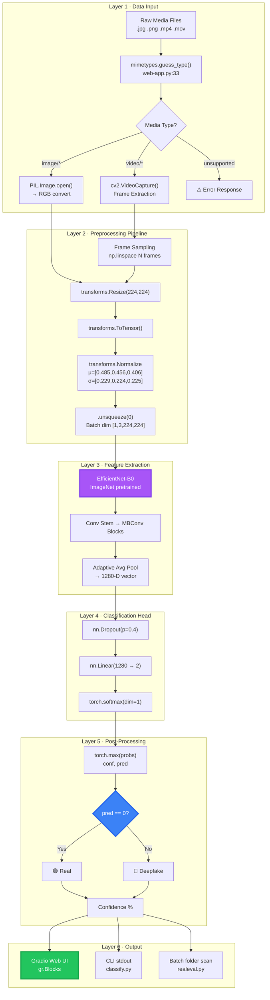

---

## 2. Detailed Component Architecture

> Maps each module in the repository to its role in the Training, Inference, Video Processing, and Tooling pipelines.

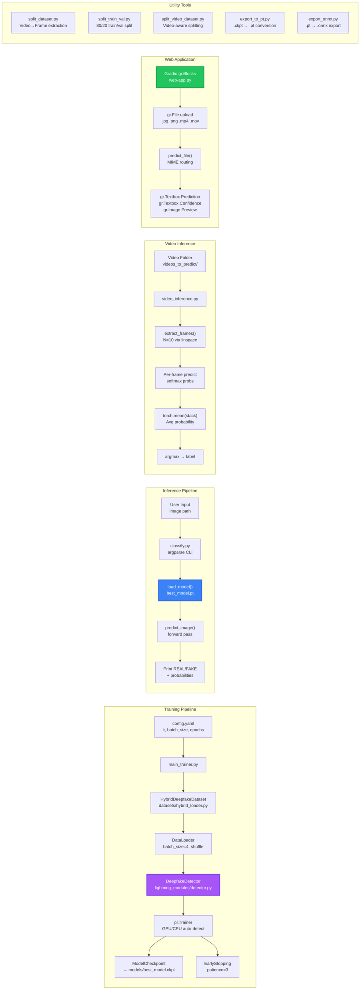

---

## 3. Data Flow Architecture

> Traces data transformation from raw upload through every processing stage. Values reference actual code parameters.

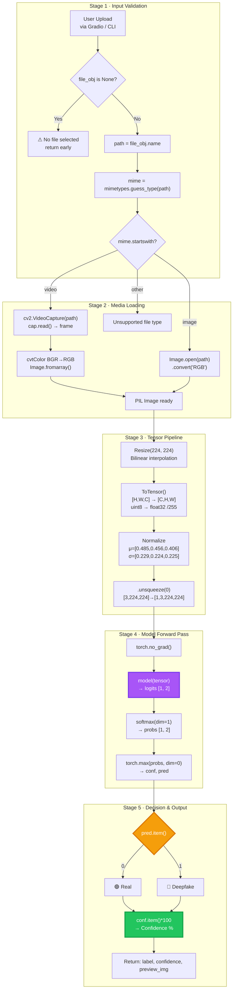

---

## 4. Use Case Diagram

> All user-facing capabilities of the system, derived from entry points: `web-app.py`, `classify.py`, `realeval.py`, `main_trainer.py`, and tool scripts.

```mermaid
graph TB
    User["👤 End User"]
    Dev["👨‍💻 ML Developer"]
    
    subgraph "Web Interface Use Cases"
        UC1["Upload Image for Detection"]
        UC2["Upload Video for Detection"]
        UC3["View Prediction & Confidence"]
        UC4["Preview Analyzed Frame"]
    end

    subgraph "CLI Use Cases"
        UC5["Classify Single Image<br/>classify.py image_path"]
        UC6["Batch Evaluate Folder<br/>realeval.py"]
        UC7["Evaluate with Noise Simulation<br/>realeval.py simulate=True"]
        UC8["Run Video Inference<br/>inference/video_inference.py"]
    end

    subgraph "Developer / Training Use Cases"
        UC9["Train Model<br/>main_trainer.py"]
        UC10["Configure Hyperparameters<br/>config.yaml"]
        UC11["Split Image Dataset<br/>tools/split_train_val.py"]
        UC12["Extract Frames from Video<br/>tools/split_dataset.py"]
        UC13["Split Video Dataset<br/>tools/split_video_dataset.py"]
        UC14["Export .ckpt → .pt<br/>tools/export_to_pt.py"]
        UC15["Export .pt → .onnx<br/>inference/export_onnx.py"]
    end

    User --> UC1
    User --> UC2
    User --> UC3
    User --> UC4
    User --> UC5
    User --> UC6

    Dev --> UC9
    Dev --> UC10
    Dev --> UC11
    Dev --> UC12
    Dev --> UC13
    Dev --> UC14
    Dev --> UC15
    Dev --> UC7
    Dev --> UC8

    style User fill:#3b82f6,stroke:#2563eb,color:#fff,stroke-width:2px
    style Dev fill:#a855f7,stroke:#7c3aed,color:#fff,stroke-width:2px
```

---

## 5. Sequence Diagrams

### 5.1 Web App — Image Upload Flow (`web-app.py`)

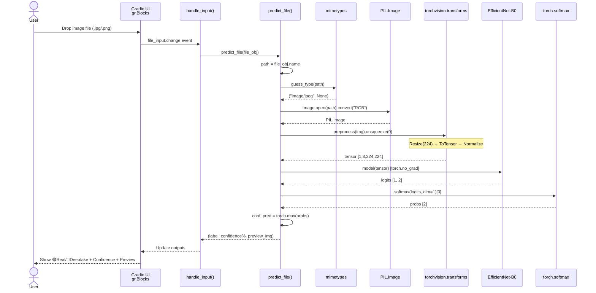

### 5.2 Web App — Video Upload Flow (`web-app.py`)

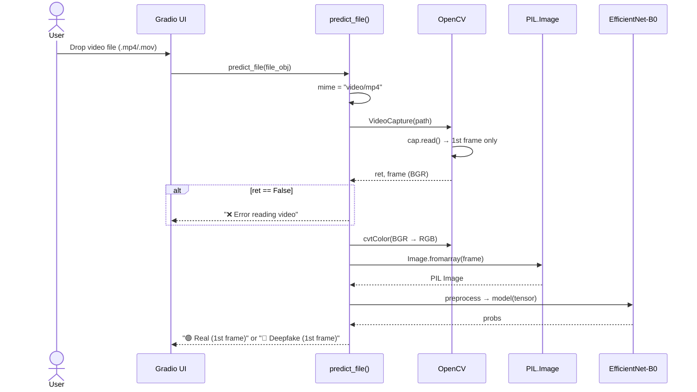

### 5.3 Multi-Frame Video Inference (`inference/video_inference.py`)

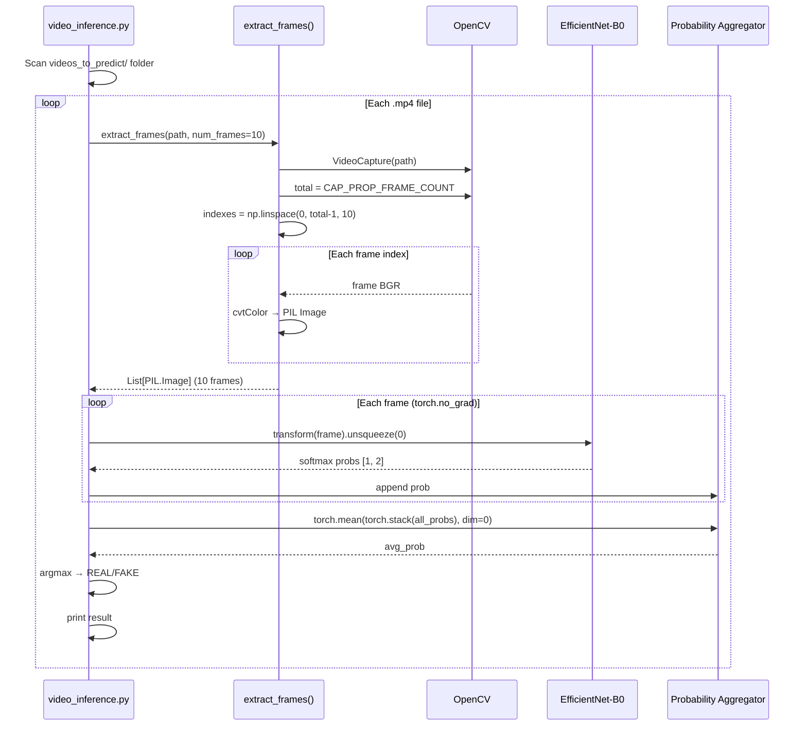

### 5.4 Training Pipeline (`main_trainer.py`)

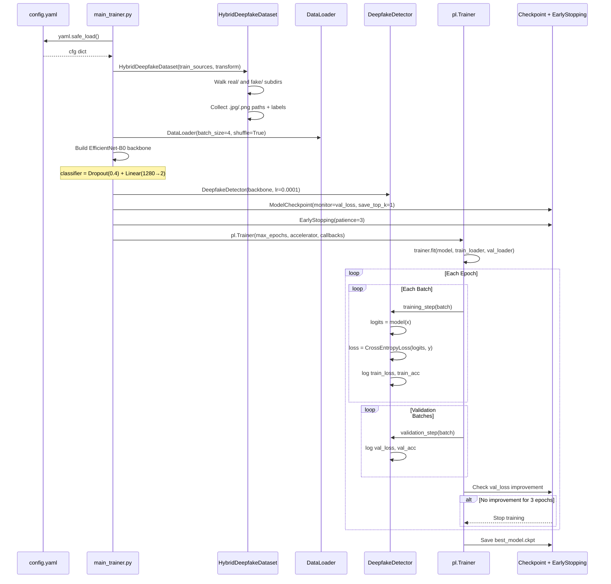

---

## 6. Class Diagrams

> Actual classes, methods, attributes, and inheritance from the codebase.

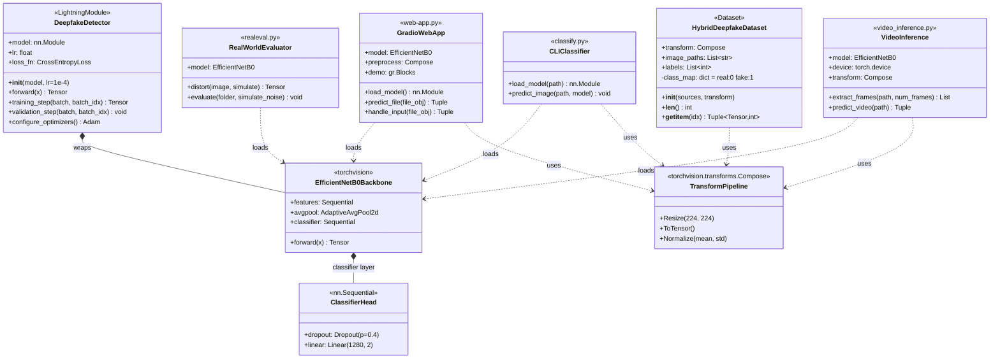

### 6.2 Tools & Export Classes

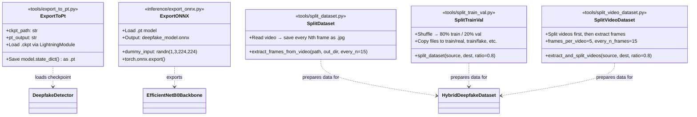

---

## 7. Activity Diagrams

### 7.1 Image Classification Activity

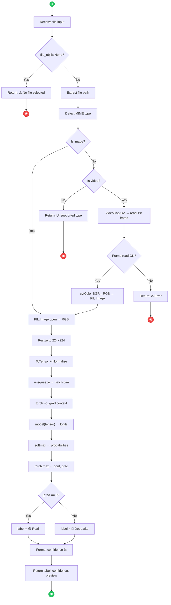

### 7.2 Model Training Activity

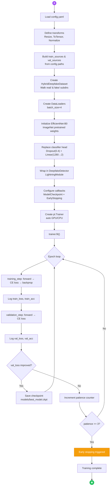

### 7.3 Dataset Preparation Activity

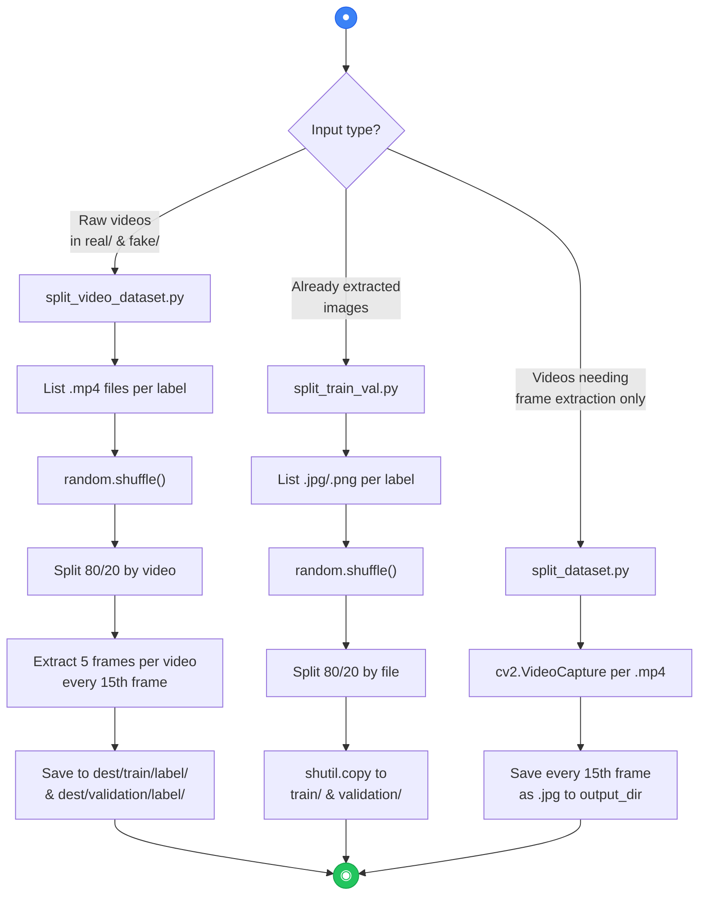

---

## 8. System Component Interaction

> Shows how every file in the repository interacts with every other file at runtime and build time.

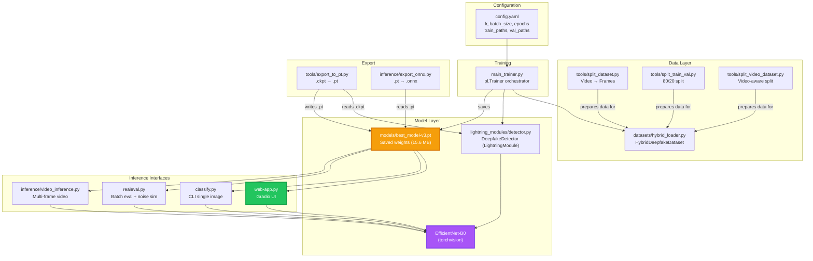

---

## 9. Deployment Architecture — Local Development

> Actual local setup: single-machine, no containers, Python virtual environment.

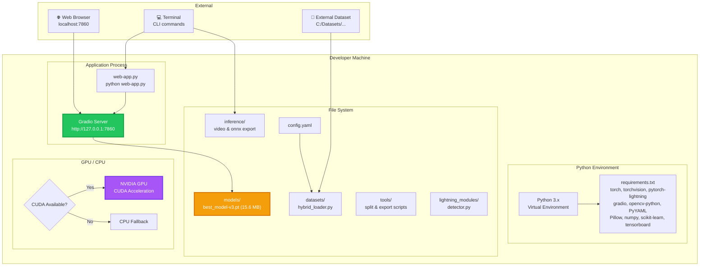

---

## 10. Deployment Architecture — Production

> Recommended production deployment with containerization, reverse proxy, and model serving.

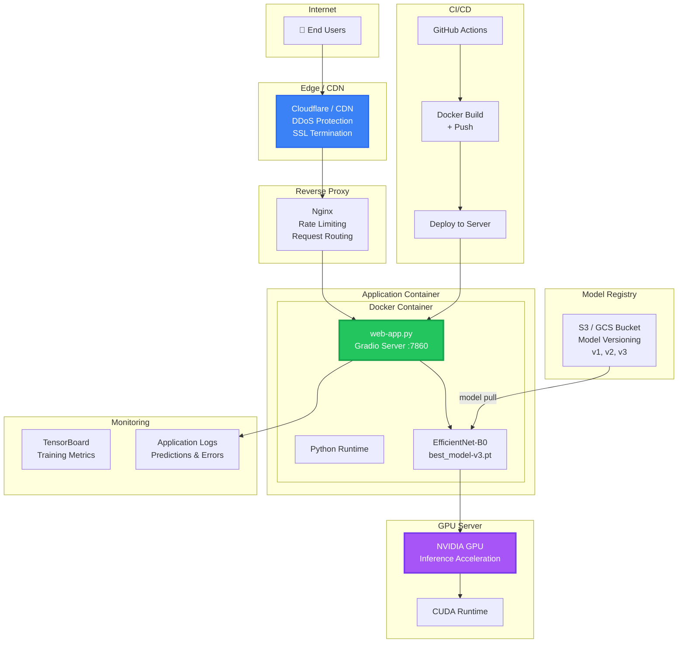

---

## 11. Security Architecture

> File validation, model integrity, and input sanitization as implemented in the codebase.

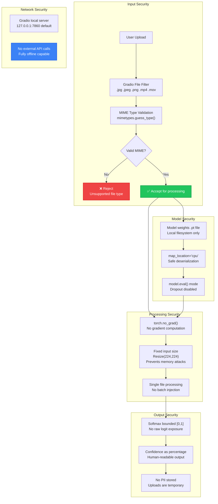

---

## 12. State Machine Diagram — Threat Score Zones

> Maps the softmax probability output to threat assessment zones.

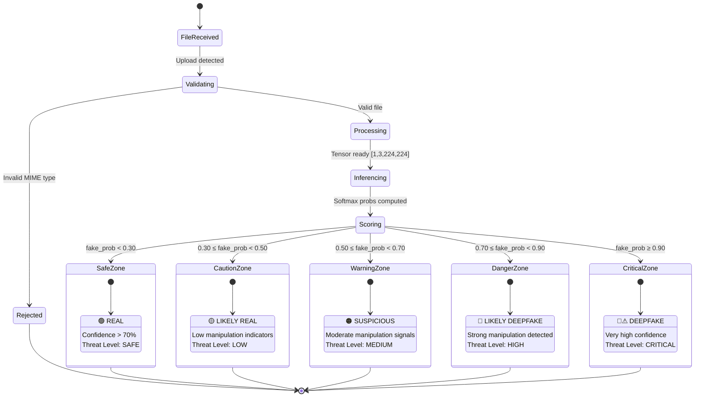

---

## 13. Entity Relationship Diagram

> Data entities and their relationships across the system.

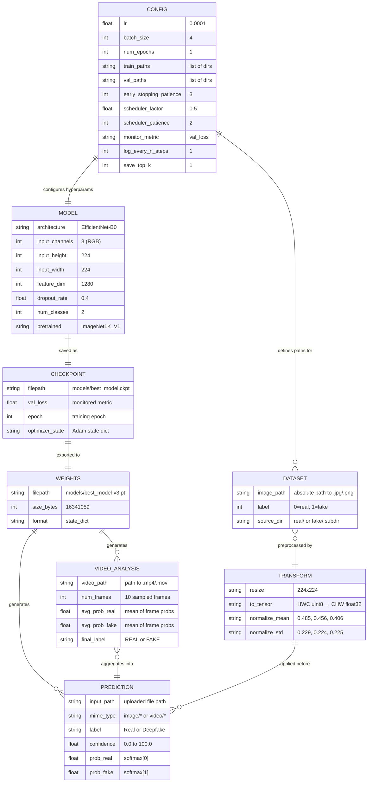

---

## 14. Architecture Summary

### Repository Structure Map

```
DeepfakeDetector/
├── config.yaml                    # Hyperparameters & dataset paths
├── main_trainer.py                # Training orchestrator (PyTorch Lightning)
├── classify.py                    # CLI single-image classifier
├── realeval.py                    # Batch evaluator with noise simulation
├── web-app.py                     # Gradio web interface
├── requirements.txt               # Python dependencies (10 packages)
│
├── models/
│   └── best_model-v3.pt           # Trained weights (15.6 MB)
│
├── datasets/
│   └── hybrid_loader.py           # HybridDeepfakeDataset (PyTorch Dataset)
│
├── lightning_modules/
│   └── detector.py                # DeepfakeDetector (LightningModule)
│
├── inference/
│   ├── video_inference.py         # Multi-frame video classification
│   └── export_onnx.py             # ONNX model export
│
└── tools/
    ├── export_to_pt.py            # .ckpt → .pt converter
    ├── split_dataset.py           # Video frame extractor
    ├── split_train_val.py         # Image dataset splitter (80/20)
    └── split_video_dataset.py     # Video-aware dataset splitter
```

### Core Technical Specifications

| Component | Specification |
|---|---|
| **Backbone** | EfficientNet-B0 (torchvision, ImageNet-1K pretrained) |
| **Feature Dimension** | 1280-D (Global Average Pooling output) |
| **Classifier Head** | Dropout(0.4) → Linear(1280, 2) |
| **Input Resolution** | 224 × 224 × 3 (RGB) |
| **Normalization** | μ=[0.485, 0.456, 0.406], σ=[0.229, 0.224, 0.225] |
| **Loss Function** | CrossEntropyLoss |
| **Optimizer** | Adam (lr=0.0001) |
| **Early Stopping** | patience=3, monitor=val_loss |
| **Checkpoint Strategy** | save_top_k=1, monitor=val_loss, mode=min |
| **Video Sampling** | N=10 frames via np.linspace (uniform) |
| **Video Aggregation** | Mean probability across sampled frames |
| **Model File** | best_model-v3.pt (15.6 MB, state_dict format) |
| **Web Framework** | Gradio (gr.Blocks) |
| **Supported Inputs** | .jpg, .jpeg, .png, .mp4, .mov |
| **Output Classes** | 0 = Real, 1 = Fake |

### Pipeline Summary


